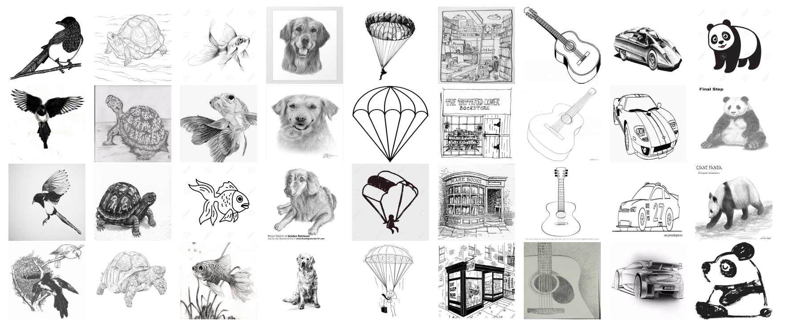

# ImageNet-Sketch

## Description

ImageNet-Sketch data set consists of 50000 images, 50 images for each of the 1000 ImageNet classes. 
We construct the data set with Google Image queries "sketch of \_\_", where \_\_ is the standard class name. 
We only search within the "black and white" color scheme.
We initially query 100 images for every class, and then manually clean the pulled images by deleting the irrelevant images and images that are for similar but different classes. 
For some classes, there are less than 50 images after manually cleaning, 
and then we augment the data set by flipping and rotating the images. 

This github repository consists of the scripts we used to conduct query and clean images. 

## Download the Data 

 - Links
     - from [Google Drive](https://drive.google.com/open?id=1Mj0i5HBthqH1p_yeXzsg22gZduvgoNeA)
     - from [Kaggle](https://www.kaggle.com/wanghaohan/imagenetsketch)
 - Information
     - zip file is 7.8 GB
     - extracted files will be 8.4 GB
     
## Analysis 

 - An interesting analysis is performed at Kaggle, evaluating a large number of CNNs with our data set
     - [Can pretrained ImageNet models generalize to sketches](https://www.kaggle.com/rwightman/generalization-to-imagenet-sketch)

## Reference

The data set is introduced together with the following paper, so if you find this data set helpful, please consider cite: 
    
   [Learning Robust Global Representations by Penalizing Local Predictive Power](https://arxiv.org/abs/1905.13549)
   
@misc{wang2019learning,  
&nbsp;&nbsp;&nbsp;&nbsp;&nbsp;&nbsp;&nbsp;&nbsp;title={Learning Robust Global Representations by Penalizing Local Predictive Power},  
&nbsp;&nbsp;&nbsp;&nbsp;&nbsp;&nbsp;&nbsp;&nbsp;author={Haohan Wang and Songwei Ge and Eric P. Xing and Zachary C. Lipton},  
&nbsp;&nbsp;&nbsp;&nbsp;&nbsp;&nbsp;&nbsp;&nbsp;year={2019},  
&nbsp;&nbsp;&nbsp;&nbsp;&nbsp;&nbsp;&nbsp;&nbsp;eprint={1905.13549},  
&nbsp;&nbsp;&nbsp;&nbsp;&nbsp;&nbsp;&nbsp;&nbsp;archivePrefix={arXiv},  
&nbsp;&nbsp;&nbsp;&nbsp;&nbsp;&nbsp;&nbsp;&nbsp;primaryClass={cs.CV}  
}
